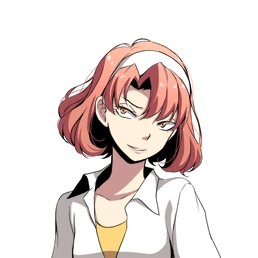
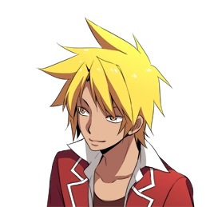

# 🎮 Misao
> Script en japonés

## 📌 Información general
- **Título original**: 操
- **Versión del juego**: 3.06.01
- **Idioma original**: Japonés
- **Autor**: [Sen](http://novice2.web.fc2.com/game/misao/index.html)
- **Script por**: Doga
- **Notas**: Este script fue extraído jugando manualmente. Tambien cabe destacar que la guia estara escrita con el personaje masculino como protagonista.
---

## ゲームスタート

📢 **システム**:
「主人公の性別を選択してください（ストーリーに変更はありません）女 | 男」

📢 **システム**:
「主人公（♂）の名前を入力してください。（キーボードで入力してください）」

📢 **システム**:
「名前入力（Ｅｎｔｅｒキーで決定）」

📢 **システム**:
「**主人公**で宜しいですか？　はい | いいえ」

📢 **システム**:
「プロローグを飛ばしますか？」

📢 **システム**:
「このゲームには**グロテスク**・**虐め**・**暴力**・**殺人**・**性的暴行**・**ブラックユーモア**・**脅かし**等の過激な表現が含まれています。苦手な片はご注意ください。この作品はフィクションです。実際の人物・団体とは一切関係ありません。」

---
👁️ **？？？**:
「タスケテ」

👁️ **？？？**:
「ワタシヲミツケテ」

---
|  | **アキ** |
|-------------------------|--------------|

「その声は操・・・・ちゃん？　操ちゃんなのか？」  
「ゆ．．．夢．．．？」  
「操ちゃんの声が聞こえた気がした・・・夢・・・だったのかな」  
「あれから３ヶ月か・・・・・・・」  
「うわぁ！　もうこんな時間だ！　急がないと学校に遅刻しちゃうよ！」  
「クラスメイトの操ちゃんは、おとなしくて目立たない・・・どちらかというと地味な女の子だった」  
「親しくはなかったけど、いつも一人でいた彼女の事が僕はずっと気になっていた」  
「親しくなれたらいいなって思ってた。　でも・・・その夢は叶わなかった・・・」  
「三ヶ月前、彼女は突然姿を消した」  
「あの日から彼女は学校へ来なくなった。　家にも帰っていないらしい」  
「家出するような子じゃないらしい。　もしかしたら何か事件に巻き込まれたんじゃないかって大人たちは言っている」  
「いってきます！」  
「クラスメイト達は皆して　彼女はもう死んだんじゃないかって噂をしてる」  
「操ちゃん・・・無事だといいな・・・・・・」  

---
👁️ **？？？**:
「ワタシヲミツケテ」

---
|  | **倉田** |
|-------------------------|--------------|

「でー、ここが―――で、あるからして一」  

---
📢 **システム**:  
「【倉田】主人公のクラスの担任を務める　ミステリアスな美形教師。その美貌から女子生徒からの人気が高い」  

---
|  | **彩加** |
|-------------------------|--------------|

「（倉田センセ、今日も超イケメ〜ン！）」  

---
|  | **アキ** |
|-------------------------|--------------|

「（夢の中で聞いたあの声・・・　あれは操ちゃんだったのかな）」  

---
|  | **倉田** |
|-------------------------|--------------|

「俺の授業でよそ見とは、いい度胸してるな」  

---
|  | **アキ** |
|-------------------------|--------------|

「ぅわっと！！」  

---
|  | **倉田** |
|-------------------------|--------------|

「テストに出る大事なとこだからな。　ちゃんと聞くように！」  

---
|  | **アキ** |
|-------------------------|--------------|

「ご、ごめんなさい！」  

---
💬 **生徒たち**:  
「クスクスクス・・・」

---
|  | **彩加** |
|-------------------------|--------------|

「今日の倉田先生、スーツ新しかったよね！　あーん、もう、超カッコイイ！」  

---
📢 **システム**:  
「【彩加（あやか）】主人公の親友。ミーハーギャル。倉田に惚れている」  

---
|  | **アキ** |
|-------------------------|--------------|

「彩加はまた今日も朝から倉田先生の話か・・・毎日毎日よく飽きないな」  

---
|  | **彩加** |
|-------------------------|--------------|

「だって超イケメンなんだもん〜！　倉田先生、マジ最高☆」  
「そうだハンドクリーム塗らなきゃ。　ふんふふーん♪」  
「知ってる？噂で聞いたんだけど　倉田先生って手フェチなんだって！」  
「だから、こうやって毎日手を綺麗にしてれば　好感度上がるかも！」  

---
|  | **アキ** |
|-------------------------|--------------|

「そんなのどうでもいいよ・・・」  

---
|  | **彩加** |
|-------------------------|--------------|

「まあ、アンタ男の子だもんね～先生よりも早乙女の方がいいに決まってるよね」  

---
|  | **アキ** |
|-------------------------|--------------|

「な、なんで早乙女さんの名前が出てくるんだよ！」  

---
|  | **彩加** |
|-------------------------|--------------|

「アンタいっつも早乙女のこと見てんじゃん。　あんなぶりっこ娘のどこがいいんだか」  

---
|  | **アキ** |
|-------------------------|--------------|

「だ、誰も好きだなんて言ってないだろ！　美人だなって思っただけで・・・・・・・」  

---
|  | **彩加** |
|-------------------------|--------------|

「ほんとかなー、ニヤニヤ」  

---
|  | **アキ** |
|-------------------------|--------------|

「ほんとだよ！」  

---
|  | **吉野** |
|-------------------------|--------------|

「最近さぁ〜、この学校で　怪現象が起きてるんだってぇ～　マジ怖いよねぇ～」  

---
|  | **叶真** |
|-------------------------|--------------|

「怪現象～？　くっだらね！」  

---
📢 **システム**:  
「【叶真（とうま）】主人公のクラスメイト。見た目、性格、すべてが軽い根っからのチャラ男」  

---
|  | **吉野** |
|-------------------------|--------------|

「マジだよ！　マジ！　こないだ隣のクラスの子がトイレで突然　誰かに足引っ張られたって！」  

---
📢 **システム**:  
「【吉野】主人公のクラスメイト。虐めグループの筆頭格。」  

---
|  | **工藤** |
|-------------------------|--------------|

「３階の廊下のガラスが　外から割られてたって事件もあったな・・・」  

---
📢 **システム**:  
「【工藤】主人公のクラスメイト。大人びていて落ち着きのある少年」  

---
|  | **吉野** |
|-------------------------|--------------|

「幽霊の仕業だったりして！」  

---
|  | **早乙女** |
|-------------------------|--------------|

「やーん、こわ～い！」  

---
📢 **システム**:  
「【早乙女】主人公のクラスメイト。通称「おとめ」叶真の彼女」  

---
|  | **叶真** |
|-------------------------|--------------|

「幽霊～？　バッカ！　んなもんいるワケねーじゃん！」  
「待てよ・・・もしかすると・・・・・・操の呪いかも・・・」  

---
|  | **工藤** |
|-------------------------|--------------|

「お前、そういう冗談やめろよな・・・」  

---
|  | **吉野** |
|-------------------------|--------------|

「っていうか超ありえるんですけど！　だってアイツがいなくなったのって三ヶ月前じゃん！　怪現象は三ヶ月前から急に起き始めたんだよ！」  

---
|  | **叶真** |
|-------------------------|--------------|

「その怪現象が操の呪いだとすれば・・・・・・・　吉野、お前は遅かれ早かれ、いずれ呪われるな」  

---
|  | **吉野** |
|-------------------------|--------------|

「はぁ？！　アタシが何したってのよ！」  

---
|  | **叶真** |
|-------------------------|--------------|

「オマエ、操のことイジメてたじゃん！」  

---
|  | **吉野** |
|-------------------------|--------------|

「いじめてねーし！　ちょっとからかっただけだっつーの！」  
「っていうか、叶真だって操のこと弄んでたじゃん！　呪い殺されるのはアンタの方でしょ！」  

---
|  | **叶真** |
|-------------------------|--------------|

「オレ？オレは大丈夫だって！　操はオレに惚れてんだから！」  

---
|  | **工藤** |
|-------------------------|--------------|

「どうだか・・・」  

---
|  | **早乙女** |
|-------------------------|--------------|

「叶真ぁ、わたし、こわい・・・わたし、叶真の彼女だからぁ操にうらまれてるかもお」  

---
|  | **叶真** |
|-------------------------|--------------|

「心配すんな、おとめ。　オレが守ってやるって」  

---
|  | **早乙女** |
|-------------------------|--------------|

「やーん！　叶真、やさしい〜！」  

---
|  | **吉野** |
|-------------------------|--------------|

「ケッ！　勝手にやってろ、バカップルが！」  

---
|  | **叶真** |
|-------------------------|--------------|

「操ちゃ〜ん、どうかオレらだけは呪わないで～！」  
「なーんちゃって！　ぎゃはははははっ！」  

---
|  | **吉野** |
|-------------------------|--------------|

「地震．．．！？」  

---
|  | **叶真** |
|-------------------------|--------------|

「な、なんだよ！急に空が暗くなったぞ！　いったい何が起こってんだ！？」  

---
|  | **吉野** |
|-------------------------|--------------|

「もしかして・・・マジで操の呪い？」  
「操がアタシたちのこと怒ってるんだ！」  

---
|  | **叶真** |
|-------------------------|--------------|

「バ、バカッ！なに言ってんだよ！　呪いなんて冗談に決まってんだろッ！」  

---
|  | **アキ** |
|-------------------------|--------------|

「う・・・ッ！」  

---
|  | **彩加** |
|-------------------------|--------------|

「アキ？」  

---
👁️ **？？？**:  
「タスケテ・・・・」   

---
|  | **アキ** |
|-------------------------|--------------|

「操・・・ちゃん？」  
「操ちゃんなのか！？」  
「操ちゃんの声が聞こえる・・・」  

---
|  | **吉野** |
|-------------------------|--------------|

「やっぱり、操の呪いよ・・・！」  

---
|  | **叶真** |
|-------------------------|--------------|

「バ、バーロー！　オレは操の声なんか聴こえないぜ！」  
「アキ！　テ、テメェ！　デタラメなコト言ってんじゃねーぞ！」  

---
|  | **アキ** |
|-------------------------|--------------|

「デタラメじゃ・・・！う・・・ッ！！」  

---
👁️ **？？？**:  
「ワタシヲミックテ」   

---
|  | **アキ** |
|-------------------------|--------------|

「み・・・みさ・・・お・・・ちゃ・・・」  
「うわああああああああああっ！！！」  
「主人公」  
「操ちゃん・・・」  
「」  
