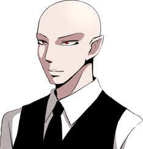
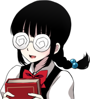

# 🎮 Misao
> Script en japonés

## 📌 Información general
- **Título original**: 操
- **Versión del juego**: 3.06.01
- **Idioma original**: Japonés
- **Autor**: [Sen](http://novice2.web.fc2.com/game/misao/index.html)
- **Script por**: Doga
- **Notas**: Este script fue extraído jugando manualmente. Tambien cabe destacar que la guia estara escrita con el personaje masculino como protagonista.
---

## ゲームスタート

📢 **システム**:
「主人公の性別を選択してください（ストーリーに変更はありません）女 | 男」

📢 **システム**:
「主人公（♂）の名前を入力してください。（キーボードで入力してください）」

📢 **システム**:
「名前入力（Ｅｎｔｅｒキーで決定）」

📢 **システム**:
「**アキ**で宜しいですか？　はい | いいえ」

📢 **システム**:
「プロローグを飛ばしますか？」

📢 **システム**:
「このゲームには**グロテスク**・**虐め**・**暴力**・**殺人**・**性的暴行**・**ブラックユーモア**・**脅かし**等の過激な表現が含まれています。苦手な片はご注意ください。この作品はフィクションです。実際の人物・団体とは一切関係ありません。」

---
👁️ **？？？**:
「タスケテ」

👁️ **？？？**:
「ワタシヲ ミツケテ」

---
|  | **アキ** |
|-------------------------|--------------|

「その声は操・・・・ちゃん？　操ちゃんなのか？」  
「操ちゃん！！」  
「ゆ．．．夢．．．？」  
「操ちゃんの声が聞こえた気がした・・・夢・・・だったのかな」  
「あれから３ヶ月か・・・・・・・」  
「うわぁ！　もうこんな時間だ！　急がないと学校に遅刻しちゃうよ！」  
「クラスメイトの操ちゃんは、おとなしくて目立たない・・・どちらかというと地味な女の子だった」  
「親しくはなかったけど、いつも一人でいた彼女の事が僕はずっと気になっていた」  
「親しくなれたらいいなって思ってた。　でも・・・その夢は叶わなかった・・・」  
「三ヶ月前、彼女は突然姿を消した」  
「あの日から彼女は学校へ来なくなった。　家にも帰っていないらしい」  
「家出するような子じゃないらしい。　もしかしたら何か事件に巻き込まれたんじゃないかって大人たちは言っている」  
「いってきます！」  
「クラスメイト達は皆して　彼女はもう死んだんじゃないかって噂をしてる」  
「操ちゃん・・・無事だといいな・・・・・・」  

---
👁️ **？？？**:
「ワタシヲ ミツケテ」

---
|  | **倉田** |
|-------------------------|--------------|

「でー、ここが―――で、あるからして一」  

---
📢 **システム**:  
「【倉田】アキのクラスの担任を務める　ミステリアスな美形教師。その美貌から女子生徒からの人気が高い」  

---
|  | **彩加** |
|-------------------------|--------------|

「（倉田センセ、今日も超イケメ〜ン！）」  

---
|  | **アキ** |
|-------------------------|--------------|

「（夢の中で聞いたあの声・・・　あれは操ちゃんだったのかな）」  

---
|  | **倉田** |
|-------------------------|--------------|

「俺の授業でよそ見とは、いい度胸してるな」  

---
|  | **アキ** |
|-------------------------|--------------|

「ぅわっと！！」  

---
|  | **倉田** |
|-------------------------|--------------|

「テストに出る大事なとこだからな。　ちゃんと聞くように！」  

---
|  | **アキ** |
|-------------------------|--------------|

「ご、ごめんなさい！」  

---
💬 **生徒たち**:  
「クスクスクス・・・」

---
|  | **彩加** |
|-------------------------|--------------|

「今日の倉田先生、スーツ新しかったよね！　あーん、もう、超カッコイイ！」  

---
📢 **システム**:  
「【彩加（あやか）】アキの親友。ミーハーギャル。倉田に惚れている」  

---
|  | **アキ** |
|-------------------------|--------------|

「彩加はまた今日も朝から倉田先生の話か・・・毎日毎日よく飽きないな」  

---
|  | **彩加** |
|-------------------------|--------------|

「だって超イケメンなんだもん〜！　倉田先生、マジ最高☆」  
「そうだハンドクリーム塗らなきゃ。　ふんふふーん♪」  
「知ってる？噂で聞いたんだけど　倉田先生って手フェチなんだって！」  
「だから、こうやって毎日手を綺麗にしてれば　好感度上がるかも！」  

---
|  | **アキ** |
|-------------------------|--------------|

「そんなのどうでもいいよ・・・」  

---
|  | **彩加** |
|-------------------------|--------------|

「まあ、アンタ男の子だもんね～先生よりも早乙女の方がいいに決まってるよね」  

---
|  | **アキ** |
|-------------------------|--------------|

「な、なんで早乙女さんの名前が出てくるんだよ！」  

---
|  | **彩加** |
|-------------------------|--------------|

「アンタいっつも早乙女のこと見てんじゃん。　あんなぶりっこ娘のどこがいいんだか」  

---
|  | **アキ** |
|-------------------------|--------------|

「だ、誰も好きだなんて言ってないだろ！　美人だなって思っただけで・・・・・・・」  

---
|  | **彩加** |
|-------------------------|--------------|

「ほんとかなー、ニヤニヤ」  

---
|  | **アキ** |
|-------------------------|--------------|

「ほんとだよ！」  

---
|  | **吉野** |
|-------------------------|--------------|

「最近さぁ〜、この学校で　怪現象が起きてるんだってぇ～　マジ怖いよねぇ～」  

---
|  | **叶真** |
|-------------------------|--------------|

「怪現象～？　くっだらね！」  

---
📢 **システム**:  
「【叶真（とうま）】アキのクラスメイト。見た目、性格、すべてが軽い根っからのチャラ男」  

---
|  | **吉野** |
|-------------------------|--------------|

「マジだよ！　マジ！　こないだ隣のクラスの子がトイレで突然　誰かに足引っ張られたって！」  

---
📢 **システム**:  
「【吉野】アキのクラスメイト。虐めグループの筆頭格。」  

---
|  | **工藤** |
|-------------------------|--------------|

「３階の廊下のガラスが　外から割られてたって事件もあったな・・・」  

---
📢 **システム**:  
「【工藤】アキのクラスメイト。大人びていて落ち着きのある少年」  

---
|  | **吉野** |
|-------------------------|--------------|

「幽霊の仕業だったりして！」  

---
|  | **早乙女** |
|-------------------------|--------------|

「やーん、こわ～い！」  

---
📢 **システム**:  
「【早乙女】アキのクラスメイト。通称「おとめ」叶真の彼女」  

---
|  | **叶真** |
|-------------------------|--------------|

「幽霊～？　バッカ！　んなもんいるワケねーじゃん！」  
「待てよ・・・もしかすると・・・・・・操の呪いかも・・・」  

---
|  | **工藤** |
|-------------------------|--------------|

「お前、そういう冗談やめろよな・・・」  

---
|  | **吉野** |
|-------------------------|--------------|

「っていうか超ありえるんですけど！　だってアイツがいなくなったのって三ヶ月前じゃん！　怪現象は三ヶ月前から急に起き始めたんだよ！」  

---
|  | **叶真** |
|-------------------------|--------------|

「その怪現象が操の呪いだとすれば・・・・・・・　吉野、お前は遅かれ早かれ、いずれ呪われるな」  

---
|  | **吉野** |
|-------------------------|--------------|

「はぁ？！　アタシが何したってのよ！」  

---
|  | **叶真** |
|-------------------------|--------------|

「オマエ、操のことイジメてたじゃん！」  

---
|  | **吉野** |
|-------------------------|--------------|

「いじめてねーし！　ちょっとからかっただけだっつーの！」  
「っていうか、叶真だって操のこと弄んでたじゃん！　呪い殺されるのはアンタの方でしょ！」  

---
|  | **叶真** |
|-------------------------|--------------|

「オレ？オレは大丈夫だって！　操はオレに惚れてんだから！」  

---
|  | **工藤** |
|-------------------------|--------------|

「どうだか・・・」  

---
|  | **早乙女** |
|-------------------------|--------------|

「叶真ぁ、わたし、こわい・・・わたし、叶真の彼女だからぁ操にうらまれてるかもお」  

---
|  | **叶真** |
|-------------------------|--------------|

「心配すんな、おとめ。　オレが守ってやるって」  

---
|  | **早乙女** |
|-------------------------|--------------|

「やーん！　叶真、やさしい〜！」  

---
|  | **吉野** |
|-------------------------|--------------|

「ケッ！　勝手にやってろ、バカップルが！」  

---
|  | **叶真** |
|-------------------------|--------------|

「操ちゃ〜ん、どうかオレらだけは呪わないで～！」  
「なーんちゃって！　ぎゃはははははっ！」  

---
|  | **吉野** |
|-------------------------|--------------|

「地震．．．！？」  

---
|  | **叶真** |
|-------------------------|--------------|

「な、なんだよ！急に空が暗くなったぞ！　いったい何が起こってんだ！？」  

---
|  | **吉野** |
|-------------------------|--------------|

「もしかして・・・マジで操の呪い？」  
「操がアタシたちのこと怒ってるんだ！」  

---
|  | **叶真** |
|-------------------------|--------------|

「バ、バカッ！なに言ってんだよ！　呪いなんて冗談に決まってんだろッ！」  

---
|  | **アキ** |
|-------------------------|--------------|

「う・・・ッ！」  

---
|  | **彩加** |
|-------------------------|--------------|

「アキ？」  

---
👁️ **？？？**:  
「タスケテ・・・・」   

---
|  | **アキ** |
|-------------------------|--------------|

「操・・・ちゃん？」  
「操ちゃんなのか！？」  
「操ちゃんの声が聞こえる・・・」  

---
|  | **吉野** |
|-------------------------|--------------|

「やっぱり、操の呪いよ・・・！」  

---
|  | **叶真** |
|-------------------------|--------------|

「バ、バーロー！　オレは操の声なんか聴こえないぜ！」  
「アキ！　テ、テメェ！　デタラメなコト言ってんじゃねーぞ！」  

---
|  | **アキ** |
|-------------------------|--------------|

「デタラメじゃ・・・！う・・・ッ！！」  

---
👁️ **？？？**:  
「ワタシヲ ミックテ」   

---
|  | **アキ** |
|-------------------------|--------------|

「み・・・みさ・・・お・・・ちゃ・・・」  
「うわああああああああああっ！！！」  
「んん・・・」  
「操ちゃん・・・」  

---
👤 **？？？**:  
「おやおや、やっと気が付きましたね」   

---
|  | **アキ** |
|-------------------------|--------------|

「！！」  
「さっきまで教室にいたはずじゃ」  
「あなたは・・・・・・」  

---
|  | **鬼瓦** |
|-------------------------|--------------|

「私はこの学園の生徒会長、鬼瓦。　そしてここは生徒会室」  
「あなたは運よく安全な場所へ飛ばされたようですね」  

---
|  | **アキ** |
|-------------------------|--------------|

「飛ばされた？」  

---
|  | **鬼瓦** |
|-------------------------|--------------|

「あの地震の後、学校全体が異界に飲み込まれてしまいました。その衝撃で学校にいた人間は皆、校内のどこかに飛ばされてしまったのです」  

---
|  | **アキ** |
|-------------------------|--------------|

「異界に飲み込まれた！？　いったいどういうことですか？　どうしてこんなことに・・・」  

---
|  | **鬼瓦** |
|-------------------------|--------------|

「呪いです」  
「ある少女の呪いがこの学園のすべてを異界に閉じ込めたのです」  

---
|  | **アキ** |
|-------------------------|--------------|

「呪い・・・？　まさか、操ちゃんが？」  

---
👤 **？？？**:  
「鬼瓦会長～！」   

---
|  | **？？？** |
|-------------------------|--------------|

「ぜぇ、はぁ・・・　やっとここまで辿り着けた・・・　もう、死ぬかと思っちゃいましたよ～！」  

---
|  | **鬼瓦** |
|-------------------------|--------------|

「図書室さん、やっと戻ってきましたか」  
「彼女はこの学園の副会長。　いつも図書室にいる事から図書室と呼ばれています」  
「それで、図書室さん、校内の様子は如何でしたか？」  

---
|  | **図書室** |
|-------------------------|--------------|

「それがもうメチャクチャのグチャグチャなんですよ〜　！　学校全体の構造がバラバラになっちゃって、　出口も見つからなくて閉じ込められた状態なんです！」  
「それに、あちこちに悪霊が徘徊して　人を襲ってるんですよ！　目の前で生徒が殺されるの見ちゃいました！」  
「あんなの見せられたら　もうハンバーグなんて食べられませんよ〜。　はぁ〜、おっかないです」  

---
|  | **鬼瓦** |
|-------------------------|--------------|

「わかりました。　見回りご苦労でした。　もう下がって宜しいですよ」  

---
|  | **図書室** |
|-------------------------|--------------|

「はーい、それじゃ私、図書室に戻ります！また私を使いたくなったらいつでも呼んでくださいね～☆」  

---
|  | **鬼瓦** |
|-------------------------|--------------|

「悪霊ですか・．．　呪いの力が呼び寄せてしまったのでしょう」  
「今やこの学校は悪霊の巣窟．．．どこにも逃げ場はありません」  

---
|  | **アキ** |
|-------------------------|--------------|

「そんな・・・」  

---
|  | **鬼瓦** |
|-------------------------|--------------|

「助かる方法はただひとつ・・・少女の呪いを解く事です。　これしか方法はないでしょう」  

---
|  | **アキ** |
|-------------------------|--------------|

「・・・・・・　どうすれば　呪いを解くことができるんですか？」  

---
|  | **鬼瓦** |
|-------------------------|--------------|

「少女の魂を救ってあげる事です。　主人公くん、あなたなら解るはずです。　あなたが今、何をすべきか」  

---
|  | **アキ** |
|-------------------------|--------------|

「僕が・・・？」  

---
👁️ **？？？**:  
「ワタシヲ ミックテ・・・」   

---
|  | **アキ** |
|-------------------------|--------------|

「操ちゃんが、僕を呼んでいる・・・　そっか・・・見つけて欲しいんだね・・・」  
「鬼瓦さん、僕、操ちゃんを探しに行きます！」  

---
|  | **鬼瓦** |
|-------------------------|--------------|

「・・・行くのですね。図書室から聞いたとおり　校内は悪霊で溢れ返っています。　それでも行くのですか？」  

---
|  | **アキ** |
|-------------------------|--------------|

「行きます。　だって、操ちゃんは友達ですから！」  

---
|  | **鬼瓦** |
|-------------------------|--------------|

「わかりました。　この学校の運命は、あなたに託しましょう。　あなたならこの学校を救えると信じていますよ」  
「困ったことがあれば二階の図書室を訪ねてみるといいでしょう。　彼女がきっと力になってくれます」  
「それから記録を取りたい時は私に話しかけてください。　いつでも記録して差し上げますよ」  

---
📢 **システム**:  
「セーブしますか？　セーブする | セーブしない」  
「その他、このゲームでは特殊ボタンを押すことでクイックセーブが出来ます。（ゲームを終了するとデータは消えます）詳しい説明は図書室で聞くことが出来ます。」  
「特殊ボタン　キーボード：［Ｃ］ｏｒ［Ｓｈｉｆｔ］　ゲームパッド：［Ｘ］ｏｒ［Ｂａｃｋ］」  

---
|  | **鬼瓦** |
|-------------------------|--------------|

「無事を祈っていますよ」  
